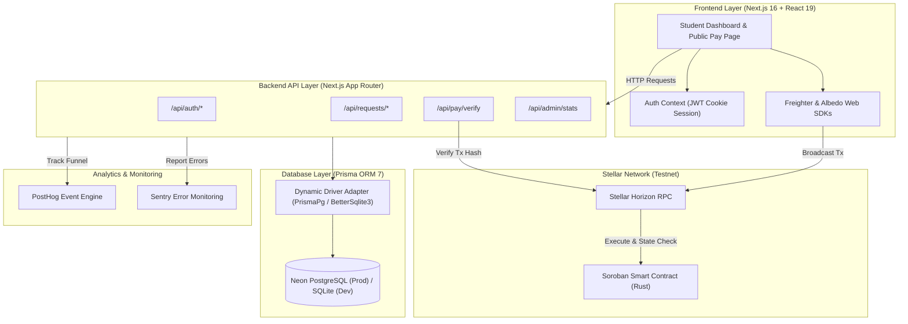

# ScholarPay — Level 5 Blue Belt Submission

> **Stellar-powered cross-border educational remittance platform built on Soroban smart contracts.**

ScholarPay eliminates expensive international bank transfer fees and opaque SWIFT delays for students studying abroad. It provides a transparent, instant, and verifiable payment flow — from student request creation to sender payment via Stellar wallets — with every transaction verified server-side and recorded on-chain.

---

## 🔗 Live Links & Submission Evidence

- **Live Demo:** https://blue-belt-f34cema1d-parasbabars-projects.vercel.app/
- **Demo Video:** https://youtu.be/vlf4wMh5DZ0?si=KJ4WAnVfRt_bKLaA
- **Pitch Deck (Slide Deck):** [https://drive.google.com/file/d/14td1JtwyS1zxcT601QOAtRjvNrXeSTV9/view?usp=sharing] *(Local Markdown version: [`docs/PITCH_DECK.md`](./docs/PITCH_DECK.md))*
- **User Feedback Form:** https://docs.google.com/forms/d/e/1FAIpQLSe9ObDBqflfx_nb5J589_dSqp7jzCBaobDvUlaHFg7k7Xr40Q/viewform?usp=sharing&ouid=112539781041533266736
- **User Validation Sheet:** https://docs.google.com/spreadsheets/d/1OsfOnBLNPz6mK8s8b7F9Cuu4pZOCbF_BdRYMAWzUuOM/edit?usp=sharing
- **GitHub Repository:** [https://github.com/parasbabar/Blue-Belt](https://github.com/parasbabar/Blue-Belt)
- **Stellar Testnet Contract:** [`CAQWR6A4JQIPR5IVPIF47KB2TJQJYFC6IDXXUZ2DRMOFFE4PDONQ7RCQ`](https://stellar.expert/explorer/testnet/contract/CAQWR6A4JQIPR5IVPIF47KB2TJQJYFC6IDXXUZ2DRMOFFE4PDONQ7RCQ)
- X link:** https://x.com/ParasBabar17809/status/2094689930220032510?s=20

---

## 🚀 Overview

Students in developing countries face significant financial friction when receiving educational funds from family or sponsors abroad:
- **High Friction & Costs**: Traditional SWIFT wire transfers incur 5% to 10% in intermediary banking and currency conversion fees.
- **Opaque Delays**: Settlements routinely take 3 to 7 business days with minimal tracking.
- **Lack of Verification**: Educational institutions and students struggle to verify payment status in real-time.

ScholarPay solves this by utilizing the **Stellar Network** and **Soroban Smart Contracts**:
- **Speed & Low Cost**: Near-instant settlement with sub-cent network fees in XLM.
- **Transparency**: End-to-end payment status tracking with verifiable Stellar Explorer transaction receipts.
- **Idempotent On-Chain Guarantee**: Soroban smart contract records payment IDs persistent on-chain to prevent double-paying or replay transactions.
- **Server-Side Verification**: ScholarPay's API independently queries the Stellar Horizon RPC to validate transaction hashes before confirming status.

---

## ✨ Key Features

- **Student Request Management** — Create, track, and manage payment requests detailing purpose (Tuition, Rent, Living Expenses), XLM amount, asset type, and deadline.
- **Public Shareable Payment Pages** — Dedicated, public `/pay/[requestId]` pages allowing external family, sponsors, or donors to fulfill payments directly.
- **Dual Wallet Support** — Native browser integration for **Freighter** (extension) and **Albedo** (web popup) wallets for seamless transaction signing.
- **Server-Side Transaction Verification** — Backend validation endpoint (`POST /api/pay/verify`) checks on-chain Horizon records before marking payments as confirmed.
- **Soroban Smart Contract** — On-chain Rust contract deployed on Stellar Testnet for payment execution and status lookup (`is_paid`).
- **Digital Transaction Receipts** — Official receipts generated with direct links to the Stellar Expert Testnet Explorer.
- **In-App & Google Form Feedback** — Integrated 1–5 star rating system on receipt pages and external validation form tracking.
- **Admin Management Portal** — Comprehensive dashboard (/admin) displaying platform metrics, total payment requests, confirmed on-chain transactions, average rating, and user feedback submissions.
- **PostHog Funnel Analytics** — End-to-end event tracking from registration through wallet connection, payment signing, and receipt viewing.
- **Sentry Error Tracking** — Client and server error monitoring with sanitized context logging and automated alerting.

---

## 🧑‍💻 How ScholarPay Works

1. **Account Registration**: Students and senders register via `/register` with role-based profiles (Student or Sender).
2. **Create Payment Request**: The student creates a request via `/dashboard` specifying title, category, XLM amount, deadline, and recipient Stellar address.
3. **Share Payment Link**: ScholarPay generates a unique public URL (`/pay/[requestId]`).
4. **Access Payment Page**: Senders or family members open the public payment link without needing to log in.
5. **Connect Stellar Wallet**: Senders connect their preferred wallet via Freighter or Albedo.
6. **Sign & Broadcast Transaction**: The wallet prompts the user to sign the XLM payment transaction, which is submitted to the Stellar network.
7. **Server Verification**: The client posts the resulting transaction hash to `/api/pay/verify`, where ScholarPay queries Horizon RPC to verify source, destination, amount, and asset code on-chain.
8. **Receipt Generation**: Once verified, the database updates status to `CONFIRMED` and issues a digital receipt (`/receipt/[paymentId]`).
9. **Submit Feedback**: Users can rate their payment experience (1 to 5 stars) and submit qualitative feedback.

---

## 🏗️ Architecture

ScholarPay is architected as a full-stack Next.js App Router application backed by a dynamic database layer, external blockchain RPC nodes, and telemetry pipelines.



---

## 🛠️ Tech Stack

| Category | Technology | Description |
|---|---|---|
| **Framework** | Next.js 16.3.3 | App Router, Server Actions, Turbopack |
| **Language** | TypeScript 5 | Strict type safety across client and server |
| **Frontend UI** | React 19, Tailwind CSS 4 | Custom dark glassmorphic design system |
| **Database** | Prisma ORM 7 | PostgreSQL (Neon Cloud) / SQLite (Local Dev) |
| **Authentication** | JWT (`jose`), `bcryptjs` | HttpOnly, Secure, SameSite=Lax cookie management |
| **Blockchain SDK** | `@stellar/stellar-sdk` v17 | Horizon client, TransactionBuilder, ScVal conversion |
| **Wallets** | `@stellar/freighter-api`, `@albedo-link/intent` | Browser extension and web popup wallet connectors |
| **Smart Contract** | Soroban SDK (`rust`) | Rust contract deployed on Stellar Testnet |
| **Analytics** | PostHog (`posthog-js`) | Product funnel and event tracking |
| **Monitoring** | Sentry (`@sentry/nextjs`) | Real-time crash reporting and exception tracing |
| **Validation** | Zod | Schema validation for API payloads and env vars |
| **Deployment** | Vercel, Neon | Cloud hosting and managed PostgreSQL database |

---

## ⭐ Stellar Integration

ScholarPay is natively built on the Stellar blockchain network:

- **Network**: Stellar **TESTNET**
- **Network Passphrase**: `Test SDF Network ; September 2015`
- **Horizon URL**: `https://horizon-testnet.stellar.org`
- **Soroban RPC URL**: `https://soroban-testnet.stellar.org`
- **Contract Address**: [`CAQWR6A4JQIPR5IVPIF47KB2TJQJYFC6IDXXUZ2DRMOFFE4PDONQ7RCQ`](https://stellar.expert/explorer/testnet/contract/CAQWR6A4JQIPR5IVPIF47KB2TJQJYFC6IDXXUZ2DRMOFFE4PDONQ7RCQ)

### Soroban Smart Contract

The smart contract ([`contracts/scholarpay/src/lib.rs`](./contracts/scholarpay/src/lib.rs)) implements key financial safety guarantees:

```rust
// Executes payment transfer and stores payment_id persistently to prevent replay
pub fn pay(env: Env, sender: Address, recipient: Address, token: Address, amount: i128, payment_id: Symbol)

// View function checking if payment_id was already executed on-chain
pub fn is_paid(env: Env, payment_id: Symbol) -> bool
```

---

## 💳 Payment Flow

```
[Payer Browser] ──(Select Freighter/Albedo)──> [Sign Transaction XDR]
                                                        │
                                          Submit to Stellar Network
                                                        │
                                              Receive Transaction Hash
                                                        │
                                                        ▼
[ScholarPay API /api/pay/verify] <──(Post Tx Hash)───────┘
          │
  Query Horizon RPC Server
          │
  ┌───────┴────────┐
  ▼                ▼
[Valid On-Chain] [Invalid / Unconfirmed]
  │                │
Update DB to      Return Verification Error
CONFIRMED          
  │
Generate Receipt
```

1. Payer connects wallet via Freighter or Albedo on the payment page.
2. The transaction XDR is generated using `@stellar/stellar-sdk` and signed in-browser.
3. The transaction is submitted to the Stellar Testnet.
4. The client sends the resulting transaction hash to ScholarPay's backend (`POST /api/pay/verify`).
5. Backend verifies that:
   - The transaction exists and completed successfully on Horizon.
   - The operation type is a valid payment.
   - The recipient address, asset type (`native` XLM), and payment amount match the stored payment request.
6. The payment status updates to `CONFIRMED`, and the user is redirected to the receipt page.

---

## 👥 User Growth & Product Validation

Level 5 Blue Belt requirements focus on scaling product usage, user validation, and structured feedback collection:

- **50+ User Validation Survey Participants**: 50+ test users onboarded through the product validation workflow, submitting structured feedback via Google Form (capturing name, email, Stellar wallet address `G...`, 1–5 star rating, and qualitative product reviews).
- **Stellar Testnet Wallet Activity**: Active testnet wallets used by participants to test payment request fulfillment using Freighter and Albedo wallet connectors.
- **Confirmed On-Chain Payment Transactions**: Real Stellar Testnet XLM payments executed on-chain, verified server-side via Horizon RPC, recorded in the database, and issued digital receipts.
- **Data Export & Transparency**: Form responses exported to Google Sheets / Excel for public submission verification.
- **Documentation**: Full growth strategy documented in [`docs/USER_GROWTH.md`](./docs/USER_GROWTH.md).

---

## 🛠️ Feedback-Driven Product Improvements

User feedback collected during testing directly drove iterative improvements across the application architecture, user experience, error resilience, and analytics tracking.

### User Feedback Iteration Process

`User Feedback → Problem Identified → Change Implemented → Commit Evidence`

1. **User Feedback**: Testers with new Testnet wallets encountered payment failures when their XLM balance was 0.
   - **Problem Identified**: Unfunded Stellar Testnet accounts cannot sign or broadcast payment transactions without initial Testnet XLM.
   - **Change Implemented**: Added an automatic detection banner on payment failure with a direct 1-click Stellar Friendbot funding recovery link.
   - **Commit Evidence**: [`79dff22`](https://github.com/parasbabar/Blue-Belt/commit/79dff2234032d8479e0f31be4d898516d2eeefd0)

2. **User Feedback**: Browser console showed red `401 Unauthorized` network error when visitors loaded public payment/receipt pages.
   - **Problem Identified**: `Navbar` called `GET /api/auth/me` to check session status. When unauthenticated, the API returned HTTP 401, triggering browser network error logs.
   - **Change Implemented**: Updated `GET /api/auth/me` to return HTTP 200 OK with `{ user: null }` for unauthenticated visitors, preserving authentication security while eliminating console errors.
   - **Commit Evidence**: [`c56d96b`](https://github.com/parasbabar/Blue-Belt/commit/c56d96bfb81f185367b66df2bfdbb5ca5ef9fdbf)

3. **User Feedback**: Admin dashboard contained redundant user counts that distracted from product validation metrics and feedback submissions.
   - **Problem Identified**: The onboarded user stat card overlapped with raw database counts and wasn't focused on transaction validation.
   - **Change Implemented**: Removed the user count card and realigned the remaining metric cards (Total Requests, Confirmed On-Chain, Avg Rating) into a responsive 3-column layout.
   - **Commit Evidence**: [`54e16c5`](https://github.com/parasbabar/Blue-Belt/commit/54e16c5a52e9a2b952f1ca9e0ee90efb22a00c6d)

4. **User Feedback**: PostHog telemetry failed to record events across key payment funnel steps in production.
   - **Problem Identified**: `posthog.__loaded` guard prevented early event dispatching, and page view triggers were missing on public payment links.
   - **Change Implemented**: Resolved PostHog client initialization, removed restrictive guards, and wired explicit event hooks across registration, wallet connection, payment signing, and receipt views.
   - **Commit Evidence**: [`b71ad07`](https://github.com/parasbabar/Blue-Belt/commit/b71ad07e1554d31d9600e628178107936a2675a3)

5. **User Feedback**: Vercel deployment builds failed due to Prisma client generation mismatches and TypeScript schema validation errors.
   - **Problem Identified**: Build environment script failed to target dual PostgreSQL (Neon) and SQLite engines correctly during production compilation.
   - **Change Implemented**: Added `scripts/prisma-generate.js` to dynamically generate the correct Prisma client engine for Vercel deployment.
   - **Commit Evidence**: [`ac889bb`](https://github.com/parasbabar/Blue-Belt/commit/ac889bb07490059c29d0aa066099b2447990acfe)

6. **User Feedback**: Transaction simulation failed on valid payment submissions due to network passphrase mismatch.
   - **Problem Identified**: Obsolete network passphrase string was referenced in Stellar SDK initialization calls.
   - **Change Implemented**: Unified network passphrase across server and client to official Stellar Testnet passphrase (`Test SDF Network ; September 2015`).
   - **Commit Evidence**: [`120ea62`](https://github.com/parasbabar/Blue-Belt/commit/120ea6228bc213eeec5fa1aa947ae5ffeaeb79bc)

7. **User Feedback**: Raw exception objects caused React rendering crashes on unhandled API errors.
   - **Problem Identified**: React 19 throws runtime errors when raw objects are passed to JSX children during error state renders.
   - **Change Implemented**: Created `formatErrorMessage` utility helper and wrapped root layouts in React Error Boundaries.
   - **Commit Evidence**: [`112ed34`](https://github.com/parasbabar/Blue-Belt/commit/112ed34)

8. **User Feedback**: First-time users needed clear instructions on how to use Stellar Testnet wallets and test payments.
   - **Problem Identified**: Lack of contextual onboarding documentation inside the core web app.
   - **Change Implemented**: Designed and implemented interactive `/faq` onboarding guide page with wallet setup instructions and step-by-step walkthroughs.
   - **Commit Evidence**: [`965ba44`](https://github.com/parasbabar/Blue-Belt/commit/965ba443d526eefdf7cfa8c9735d46e9dfd66ec0)

### Summary Table

| User Feedback | Product Improvement | Evidence / Commit |
|---|---|---|
| **Zero XLM Wallet Error** | Added instant Stellar Friendbot Funding Recovery link on payment failure | [`79dff22`](https://github.com/parasbabar/Blue-Belt/commit/79dff2234032d8479e0f31be4d898516d2eeefd0) |
| **Unnecessary 401 Console Error** | Updated `/api/auth/me` to return HTTP 200 OK with `{ user: null }` for unauthenticated visitors | [`c56d96b`](https://github.com/parasbabar/Blue-Belt/commit/c56d96bfb81f185367b66df2bfdbb5ca5ef9fdbf) |
| **Admin Dashboard UI Redesign** | Removed redundant user count card & restructured to responsive 3-column metric layout | [`54e16c5`](https://github.com/parasbabar/Blue-Belt/commit/54e16c5a52e9a2b952f1ca9e0ee90efb22a00c6d) |
| **Analytics Funnel Tracking** | Fixed PostHog initialization, removed `__loaded` guard, and wired tracking across user flows | [`b71ad07`](https://github.com/parasbabar/Blue-Belt/commit/b71ad07e1554d31d9600e628178107936a2675a3) |
| **Production Build Failure** | Created dynamic Prisma generator script & fixed TypeScript types for Vercel deployment | [`ac889bb`](https://github.com/parasbabar/Blue-Belt/commit/ac889bb07490059c29d0aa066099b2447990acfe) |
| **Stellar Network Passphrase** | Unified network passphrase to official Testnet (`Test SDF Network ; September 2015`) | [`120ea62`](https://github.com/parasbabar/Blue-Belt/commit/120ea6228bc213eeec5fa1aa947ae5ffeaeb79bc) |
| **Error Handling Resilience** | Implemented `formatErrorMessage` helper and React Error Boundaries to prevent JSX crashes | [`112ed34`](https://github.com/parasbabar/Blue-Belt/commit/112ed34) |
| **Onboarding Clarity** | Created interactive `/faq` page with wallet setup guides and payment instructions | [`965ba44`](https://github.com/parasbabar/Blue-Belt/commit/965ba443d526eefdf7cfa8c9735d46e9dfd66ec0) |

---

## 📊 Analytics

Product analytics are powered by **PostHog** ([`src/lib/analytics.ts`](./src/lib/analytics.ts)):

| Event Name | Description |
|---|---|
| `user_registered` | Fires on successful user registration |
| `user_login` | Fires when a user logs in |
| `payment_request_created` | Captures student payment request creation |
| `wallet_connected` | Tracks Freighter or Albedo wallet connection |
| `payment_started` | Tracks initiation of the payment flow |
| `payment_signed` | Fires when transaction XDR is signed by wallet |
| `transaction_submitted` | Fires when tx hash is posted to backend |
| `transaction_confirmed` | Fires when backend confirms on-chain execution |
| `receipt_viewed` | Fires when the payment receipt page is loaded |
| `feedback_submitted` | Captures 1–5 star rating submission |

---

## 🛡️ Monitoring & Error Tracking

Application monitoring is powered by **Sentry** ([`src/lib/monitoring.ts`](./src/lib/monitoring.ts)):
- **Configuration**: Sentry SDK initialized via `withSentryConfig` in [`next.config.ts`](./next.config.ts).
- **Data Hygiene**: Sanitization layer strips sensitive fields (`password`, `token`, `secret`) before event transmission.
- **Verification**: Verified end-to-end locally via `/api/monitoring/test` endpoint, confirming exception capture and event delivery to the Sentry Issues dashboard.

---

## 📱 Mobile UX & Responsiveness

ScholarPay is designed mobile-first and fully responsive across smartphones, tablets, and desktop displays. The layout utilizes CSS custom properties, dynamic grid layouts, and glassmorphic card elements for a sleek, modern fintech user experience across all screen sizes.

---

## 🖼️ Product Screenshots


---

## ⚙️ Local Development

### Prerequisites
- Node.js 20.0 or higher
- npm 10.0 or higher
- A Stellar Testnet wallet (Freighter browser extension recommended)

### Installation

1. **Clone the Repository**:
   ```bash
   git clone https://github.com/parasbabar/Blue-Belt.git
   cd Blue-Belt
   ```

2. **Install Dependencies**:
   ```bash
   npm install
   ```

3. **Configure Environment Variables**:
   Copy `.env.example` to `.env`:
   ```bash
   cp .env.example .env
   ```

4. **Initialize Database**:
   ```bash
   npx prisma db push
   ```

5. **Start Development Server**:
   ```bash
   npm run dev
   ```
   Access the application at [http://localhost:3000](http://localhost:3000).

6. **Build Production Bundle**:
   ```bash
   npm run build
   ```

---

## 🔐 Environment Variables

Configure the following environment variable names in your `.env` file or cloud platform dashboard:

```env
# Client-Side Configuration (Public)
NEXT_PUBLIC_APP_URL=
NEXT_PUBLIC_STELLAR_NETWORK=
NEXT_PUBLIC_STELLAR_NETWORK_PASSPHRASE=
NEXT_PUBLIC_STELLAR_HORIZON_URL=
NEXT_PUBLIC_STELLAR_RPC_URL=
NEXT_PUBLIC_SOROBAN_CONTRACT_ID=
NEXT_PUBLIC_POSTHOG_KEY=
NEXT_PUBLIC_POSTHOG_HOST=
NEXT_PUBLIC_SENTRY_DSN=

# Server-Only Secrets
DATABASE_URL=
JWT_SECRET=
SENTRY_DSN=
```

---

## 🧪 Testing & Verification

ScholarPay features unit, integration, and live on-chain test suites:

```bash
# Run unit & integration tests (Address validation, status state machine)
npx tsx tests/validation.test.ts

# Run authentication & database integration tests
npx tsx tests/auth.test.ts

# Run live Stellar Testnet on-chain verification tests
npx tsx tests/stellar.test.ts
```

### Verification Highlights:
- `npm run build`: Production build passes cleanly with 20 static & dynamic routes generated.
- `validation.test.ts`: 10/10 unit tests passed.
- `stellar.test.ts`: 5/5 on-chain tests passed against live Stellar Testnet RPC.

---

## 📁 Project Structure

```
Blue-Belt/
├── contracts/
│   └── scholarpay/
│       └── src/lib.rs           # Soroban smart contract (Rust)
├── docs/
│   ├── ARCHITECTURE.md          # Architecture specification
│   ├── DEPLOYMENT.md            # Production deployment guide
│   ├── PITCH_DECK.md            # Level 5 16-Slide Pitch Deck
│   ├── SMART_CONTRACT.md        # Smart contract documentation
│   ├── USER_FLOW.md             # Complete user flow diagram
│   ├── USER_GROWTH.md           # User growth & 50+ user validation guide
│   └── USER_ONBOARDING.md       # User onboarding guide
├── prisma/
│   ├── schema.prisma            # SQLite schema (Local Dev)
│   └── schema.postgresql.prisma # PostgreSQL schema (Production)
├── scripts/
│   └── prisma-generate.js       # Dynamic Prisma generator script
├── src/
│   ├── app/                     # Next.js App Router pages & API endpoints
│   │   ├── admin/               # Admin dashboard page
│   │   ├── api/                 # Backend API routes
│   │   ├── dashboard/           # Student dashboard page
│   │   ├── faq/                 # FAQ & onboarding guide page
│   │   ├── login/               # User login page
│   │   ├── pay/[requestId]/     # Public shareable payment page
│   │   ├── receipt/[paymentId]/ # Payment receipt & feedback page
│   │   ├── register/            # User registration page
│   │   └── page.tsx             # Main landing page
│   ├── components/              # Reusable UI components
│   ├── contexts/
│   │   └── AuthContext.tsx      # JWT session context provider
│   └── lib/
│       ├── analytics.ts         # PostHog tracking module
│       ├── auth.ts              # JWT signing & verification
│       ├── db.ts                # Prisma database client initializer
│       ├── env.ts               # Environment variable validator
│       ├── monitoring.ts        # Sentry error capture module
│       └── stellar.ts           # Stellar SDK & Horizon client helpers
├── tests/
│   ├── auth.test.ts             # Auth & DB integration tests
│   ├── stellar.test.ts          # Stellar Testnet live tests
│   └── validation.test.ts       # Address validation & state machine unit tests
├── .env.example                 # Environment variable template
├── next.config.ts               # Next.js & Sentry configuration
└── README.md
```

---

## 📚 Documentation

For deeper technical specifications, refer to the documentation in the [`docs/`](./docs/) directory:
- [`PITCH_DECK.md`](./docs/PITCH_DECK.md) — Complete 16-Slide Level 5 Pitch Deck.
- [`USER_GROWTH.md`](./docs/USER_GROWTH.md) — 50+ User Growth and validation strategy documentation.
- [`ARCHITECTURE.md`](./docs/ARCHITECTURE.md) — Detailed architecture diagram and layer specifications.
- [`SMART_CONTRACT.md`](./docs/SMART_CONTRACT.md) — Soroban Rust smart contract details and functions.
- [`USER_FLOW.md`](./docs/USER_FLOW.md) — Step-by-step state diagrams for students and senders.
- [`USER_ONBOARDING.md`](./docs/USER_ONBOARDING.md) — User onboarding and testing guide.
- [`DEPLOYMENT.md`](./docs/DEPLOYMENT.md) — Production deployment guidelines for Vercel and Neon.

---

## 📄 License

This project is licensed under the [MIT License](LICENSE).
